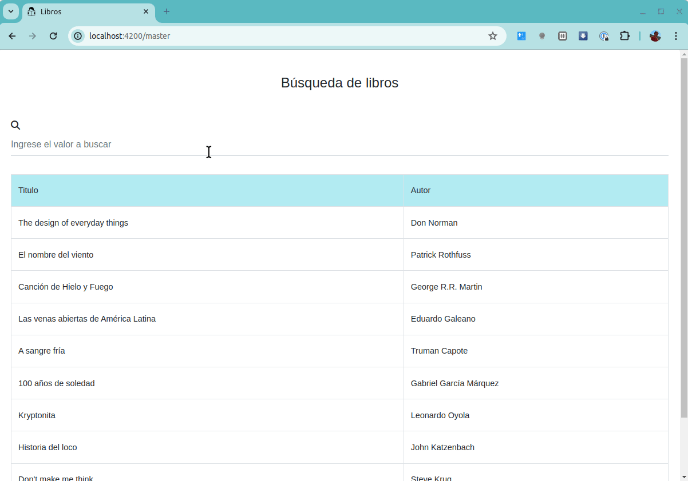
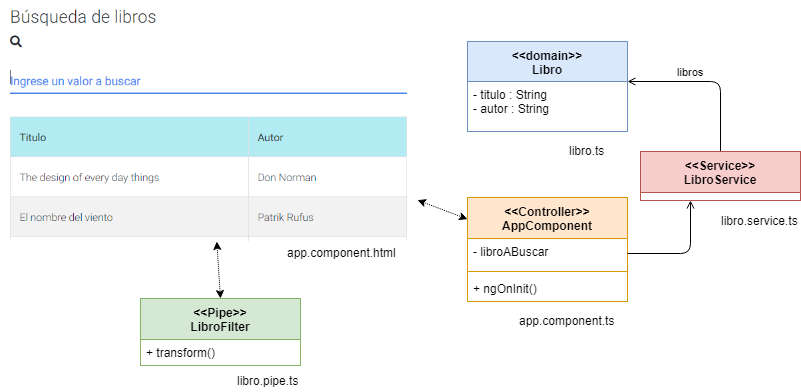

# Búsqueda de libros básica

[](https://github.com/uqbar-project/eg-libros-angular/actions/workflows/build.yml) 



## Material Design for Bootstrap

Necesitamos las dependencias de Material Design for Bootstrap

```bash
npm install mdbootstrap
```

Siguiendo [este tutorial](https://medium.com/codingthesmartway-com-blog/using-bootstrap-with-angular-c83c3cee3f4a) dentro de la propiedad styles del archivo _angular.json_ del raíz agregamos los archivos css:

```json
    "styles": [
        "src/styles.css",
        "./node_modules/mdbootstrap/css/bootstrap.min.css",
        "./node_modules/mdbootstrap/css/mdb.min.css",
        "./node_modules/mdbootstrap/css/style.css"
    ],
```

En la propiedad scripts ubicamos los archivos javascript de Material Design for Bootstrap:

```json
    "scripts": [
        "./node_modules/mdbootstrap/js/jquery.min.js",
        "./node_modules/mdbootstrap/js/bootstrap.min.js",
        "./node_modules/mdbootstrap/js/popper.min.js"
    ]
```

Otra opción es ubicarlos en el index, como se muestra a continuación:

```html
<body>
  <app-root></app-root>

  <script type="text/javascript" src="https://cdnjs.cloudflare.com/ajax/libs/jquery/3.2.1/jquery.min.js"></script>
  <script type="text/javascript" src="https://cdnjs.cloudflare.com/ajax/libs/popper.js/1.13.0/umd/popper.min.js"></script>
  <script type="text/javascript" src="https://cdnjs.cloudflare.com/ajax/libs/twitter-bootstrap/4.0.0/js/bootstrap.min.js"></script>
  <script type="text/javascript" src="https://cdnjs.cloudflare.com/ajax/libs/mdbootstrap/4.5.0/js/mdb.min.js"></script>

</body>
```

Esta opción requiere conexión online a internet, mientras que la opción anterior utiliza los archivos ya descargados en el directorio node_modules cuando lo instalamos con el npm.


## Font Awesome

Agregamos la biblioteca de íconos [Font Awesome](https://fontawesome.com/get-started) para mostrar la lupa que simboliza la búsqueda en la pantalla. En el archivo _index.html_ agregamos el css (podríamos haberlo hecho también en el archivo _angular.json_ como contamos recién):

```html
<link rel="stylesheet" href="https://cdnjs.cloudflare.com/ajax/libs/font-awesome/6.4.0/css/all.min.css">
```

## Arquitectura general de la aplicación



### Master: búsqueda de libros

Además del esquema MVC que propone Angular, vamos a incorporar:

- nuestro clásico objeto de dominio, un Libro
- un objeto encargado de proveer la lista de libros, que es parte de la arquitectura de Angular: un LibroService
- y un objeto que será encargado de hacer el filtro cuando el usuario escriba un valor a buscar, LibroFilter que forma parte de la arquitectura de Angular llamada _pipe_ (hemos visto un _pipe_ predeterminado que es el que transforma un valor decimal según el formato de una configuración regional para que por ejemplo considere la coma decimal en lugar del punto)

## Service

Para crear el service utilizamos un comando propio de Angular CLI:

```bash
ng generate service libro  # o ng g s libro
```

Esto genera el archivo libro.service.ts y su correspondiente test libro.service.spec.ts

La implementación es simplemente una lista _hardcoded_ de valores, aunque más adelante veremos que el origen de datos puede ser un servidor externo.

## Testeo unitario sobre el service

Podemos empezar a estudiar cómo funciona la inyección de dependencia del service en el test. Al configurar el fixture en el código asociado al _beforeEach_, registramos como provider al LibroService. Esto en el archivo _libro.service.spec.ts_:

```typescript
describe('LibroService', () => {
  beforeEach(() => {
    TestBed.configureTestingModule({
      providers: [LibroService]
    })
  })
```

Luego, en cada test recibimos la referencia al servicio mockeado para poder utilizarlo:

```typescript
  it('should be created', inject([LibroService], (service: LibroService) => {
    expect(service).toBeTruthy()
  }))
})
```

En este caso no es demasiado interesante lo que ocurre, el servicio mockeado coincide con el servicio original. Pero cuando tenemos que acceder a servicios remotos (y presumiblemente costosos), podemos reemplazar el comportamiento del service por otro más controlado para facilitar las pruebas unitarias. Y a su vez también podemos hacer esto para testear nuestros componentes de Angular. En ejemplos posteriores veremos más en profundidad este tema.

Testearemos dos clases de equivalencia sobre el servicio:

- la primera, el caso exitoso: el servicio nos devuelve un libro que existe
- la segunda, un caso no exitoso: el servicio no encuentra un libro

## Pipe

También creamos un pipe mediante un comando Angular CLI:

```bash
ng generate pipe libro   # o ng g p libro
```

Esto genera el archivo libro.pipe.ts y su correspondiente test `libro.pipe.spec.ts`.

El pipe sabe hacer la búsqueda por título o autor en base al valor ingresado (cuando no hay nada ingresado no se aplica ningún filtro); esto lo resuelve la implementación del método transform que define la interfaz de un pipe de Angular:

```typescript
@Pipe({
  name: 'libroFilter'
})
export class LibroFilter implements PipeTransform {

  transform(libros: Libro[], libroABuscar: string): Libro[] {
    return libros.filter(libro =>
      !libroABuscar || this.coincide(libro.titulo, libroABuscar) || this.coincide(libro.autor, libroABuscar)
    )
  }

  coincide(valor1: string, valor2: string) {
    return valor1.toLowerCase().match(valor2.toLowerCase())
  }
}
```

Además se incorpora la annotation @Pipe a nuestra clase LibroFilter.

## Testeo unitario sobre el pipe

Para probar el pipe vamos a crear una lista de libros propia dentro de nuestro test (archivo _libro.pipe.spec.ts_):

```typescript
const libros = [new Libro('Rayuela', 'Cortazar', 'Alfaguara', 220), new Libro('Ficciones', 'Borges', 'Planeta', 310)]
```

Luego del típico test de creación del filtro exitosa, vamos a realizar estas pruebas:

- si no ingreso valores a filtrar debe devolver la misma lista de libros original
- al ingresar un valor, funciona la búsqueda por título sin tomar en cuenta mayúsculas / minúsculas. En nuestro ejemplo ingresamos "rayu" lo que debe traer el libro "Rayuela" de Cortázar.
- y al ingresar un valor, funciona la búsqueda por autor sin tomar en cuenta mayúsculas / minúsculas. En nuestro ejemplo ingresamos "bor" lo que debe traer el libro "Ficciones" de Borges.

Dejamos uno de los tests de ejemplo y el lector puede investigar la implementación donde hicimos un pequeño refactor para no repetir la misma pregunta en ambos tests:

```typescript
describe('LibroPipe', () => {
  ...
  it('filters by title (case insensitive)', () => {
    const pipe = new LibroFilter()
    const librosFiltrados : Libro[] = pipe.transform(libros, 'rayu')
    expect(librosFiltrados.length).toBe(1)
    const rayuela = librosFiltrados.pop()
    expect(rayuela.titulo).toBe('Rayuela')
  })
})
```

## La aplicación MVC

En sí la aplicación tiene una vista _libro-master.component.html_ con componentes propios de [Material Design for Bootstrap](https://mdbootstrap.com/), específicamente con dos tipos de binding:

- el input con binding bidireccional contra la propiedad libroABuscar del componente

```html
<div class="md-form">
    <input type="text" [(ngModel)]="libroABuscar" class="form-control">
    <label for="form1">Ingrese un valor a buscar</label>
</div>
```

- y la tabla de libros contra la propiedad libros del mismo componente principal

```html
<!-- dentro de la tabla -->
  @for (libro of libros | libroFilter: libroABuscar ; track libro) {
    <tr [routerLink]="['/detail', libro.id]">
      <td data-testid="titulo">{{libro.titulo}}</td>
      <td data-testid="autor">{{libro.autor}}</td>
    </tr>
  }
```

El pipe libroFilter se aplica como filtro de los libros asociados, para lo cual debemos importar el _pipe_ en el componente:

```ts
@Component({
  selector: 'app-libros-master',
  standalone: true,
  imports: [..., LibroFilter, ...],
```

El controller (_libro-master.component.ts_) delega la búsqueda de los libros al service y sirve como contenedor del estado de la vista. El libro representa un objeto de dominio con atributos y algunos métodos que veremos a continuación.

## Testing del componente principal

En lugar de trabajar con el servicio que definimos, vamos a construir un stub de testing (_stub.libro.service.ts_), que define dos libros: Rayuela y Cortázar. Ese stub lo vamos a inyectar dentro del componente principal AppComponent en la inicialización de nuestro fixture:

```typescript
  beforeEach(async () => {
    await TestBed.configureTestingModule({
      imports: [LibrosMasterComponent, RouterModule.forRoot([])],
      providers: [
        { provide: LibroService, useClass: StubLibroService }
      ]
    }).compileComponents()
```

Mediante la configuración _providers_ agregamos el stub que luego se pasa a la referencia app que decora nuestra aplicación Angular. A partir de aquí podemos probar:

- que la búsqueda devuelve el libro Rayuela (que no forma parte del servicio original)
- que podemos filtrar por título (devuelve el libro "Ficciones" de Borges y no "Rayuela")
- que podemos filtrar por autor (el mismo resultado que en el test anterior)

```typescript
it('should return ok all books', async(() => {
  const filasLibros = getAllByTestId(fixture, 'titulo')
  expect(filasLibros.length).toBe(2)
  expect(filasLibros[0].textContent.trim()).toBe('Rayuela')
}))
it('should filter ok books by title', async(() => {
  app.libroABuscar = 'Fic'
  fixture.detectChanges()
  soloHayUnLibro(fixture, 'Ficciones')
}))
it('should filter ok books by author', async(() => {
  app.libroABuscar = 'bor'
  fixture.detectChanges()
  soloHayUnLibro(fixture, 'Ficciones')
}))
```

Para no trabajar con un identificador unívoco en libro, la técnica alternativa que utilizamos aquí fue:

- definir un `data-testid` general para identificar las columnas título y autor, en el html:

```html
<td data-testid="titulo">{{libro.titulo}}</td>
```

- en lugar de buscar un solo data-testid específico, recuperaremos todos los data-testid que contengan "título". Esto lo hacemos en una función auxiliar, en el archivo `test-utils.ts`:

```ts
export const getAllByTestId = (appComponent: any, testId: string) => {
  const compiled = appComponent.debugElement.nativeElement
  return compiled.querySelectorAll(`[data-testid="${testId}"]`)
}
```

- y por último, generamos una abstracción de más alto nivel, la función que nos permite saber si hay un solo libro cuyo título sea un valor específico

```ts
const soloHayUnLibro = (fixture: any, titulo: string) => {
  const filasLibros = getAllByTestId(fixture, 'titulo')
  expect(filasLibros.length).toBe(1)
  expect(filasLibros[0].textContent.trim()).toBe(titulo)
}
```

- podemos además validar la cantidad de libros que recibimos tras aplicar la búsqueda: de esa manera tenemos tests unitarios (el pipe, el service) y de integración (el componente que llama al pipe, el service no participa de esta integración ya que lo estamos mockeando, [Martin Fowler](https://martinfowler.com/bliki/UnitTest.html) diría que es un test social en cuanto al pipe pero solitario en cuanto al service)

## Navegación master a detail

En la página principal (master) utilizamos un css específico para mostrar el libro sobre el cual nos paramos (_hover_) con un color especial y el cursor con una manito:

```css
tr:hover {
  background-color: beige;
  cursor: pointer;
}
```

Para navegar cada row tiene un routerLink que nos lleva a `/detail/:id`. Por ejemplo, para el libro con identificador 2, se genera la ruta `/detail/2`:

```html
<tr [routerLink]="['/detail', libro.id]">
```

Para poder utilizar el routerLink tenemos que importar el módulo de routing en el componente:

```ts
@Component({
  selector: 'app-libros-master',
  standalone: true,
  imports: [..., RouterModule],
```

## Recuperación del libro en el componente detail

La comunicación entre master/detail se da por el identificador del libro, entonces lo que vamos a hacer es

- recibir el identificador en base a la ruta: `/detail/2` => obtenemos el id 2
- y recuperaremos el libro a partir de pedírselo al service (un detalle de implementación es que el número al participar de la URL viene como string y hay que convertirlo a number)

Necesitamos para eso inyectar el objeto `ActivatedRoute`:

```ts
  constructor(
    ...
    private route: ActivatedRoute
  ) {}

  ngOnInit() {
    this.route.params.subscribe((editarLibroParameters) => {
      const libro = this.libroService.getLibro(+(editarLibroParameters['id']))
```

El componente guarda en un estado intermedio el libro y también tiene dos métodos aceptar() y cancelar() que terminan navegando a la pantalla inicial. Esto lo hacemos en forma programática, inyectando el `router`:

```ts
navegarAHome() {
  this.router.navigate(['/master']) // router se inyecta en el constructor
}

aceptar() {
  this.libroService.actualizar(this.libroEdicion)
  this.navegarAHome()
}

cancelar() {
  this.navegarAHome()
}
```

## Libro intermedio vs. el libro

En una app donde tengamos una base de datos, podemos tener una sola referencia al libro, 

- si el usuario presiona Cancelar, podemos ir al origen de datos y volver a pedir la información original descartando los valores intermedios
- si el usuario presiona Aceptar, debemos informar al origen de datos cuáles son los nuevos datos del libro y luego sí podemos volver a la pantalla inicial donde tendremos la nueva información del libro dentro de la lista que recibimos del origen de datos

Como nosotros tenemos un service **singleton** que trabaja con una colección en memoria, si nosotros hacemos cambios en el libro y luego presionamos Cancelar, el service y la vista comparten **el mismo objeto**, con lo cual perderemos la información que teníamos antes. Entonces la estrategia requiere hacer una copia del objeto Libro y o bien 1. la edición se hace sobre el libro intermedio y luego al Aceptar pisamos los valores del objeto Libro original, o 2. la edición se hace sobre el libro original y al cancelar se pisa el libro original con la copia antes de comenzar el caso de uso de edición. Nosotros fuimos por la variante 1:

```ts
ngOnInit() {
  // en la inicialización hacemos una copia del libro que recibimos
  ...
  const libro = this.libroService.getLibro(+(editarLibroParameters['id']))
  this.libro = libro

  // éste es el libro que editamos en la vista
  this.libroEdicion = libro.generarCopia()
}
```

Veamos cómo la vista hace el binding de un control:

```html
<div class="md-form">
  <input type="number" [(ngModel)]="libroEdicion.paginas" ...
```

Y finalmente al presionar el botón Aceptar le pasamos al service el objeto Libro editado:

```ts
aceptar() {
  this.libroService.actualizar(this.libroEdicion)
  ...
}
```

El service pisa entonces los datos a partir de otro método que tiene el objeto de dominio:

```ts
actualizar(libroActualizado: Libro) {
  const libro = this.getLibro(libroActualizado.id)
  ...
  libro.actualizarDesde(libroActualizado)
}
```

## Testing

